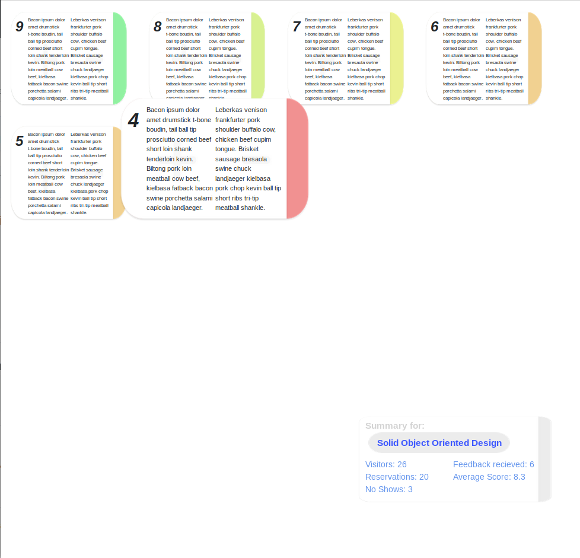

# WebFiddler
## in this repository
I use this repository to test html and css. Most of these concepts can be found in my other projects however I do like playing around with html from time to time. 

Currently following projects can be found:
* an iconbar opening and closing smoothly when you hover over it
* feedback collections with cards changing color to indicate the score given by the author.
* Website menubar which slides over a still image
## Demo's and previews:

### smooth iconbar

### feedback collector:

### menu toolbar
 