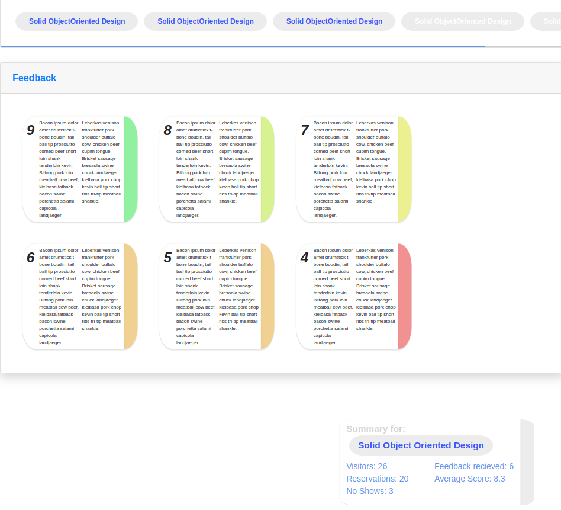

# WebFiddler
## in this repository
I use this repository to test html and css. Most of these concepts can be found in my other projects however I do like playing around with html from time to time. 

Currently following projects can be found:
* feedback collections with cards changing color to indicate the score given by the author.

## Demo's and previews:
### feedback collector:
